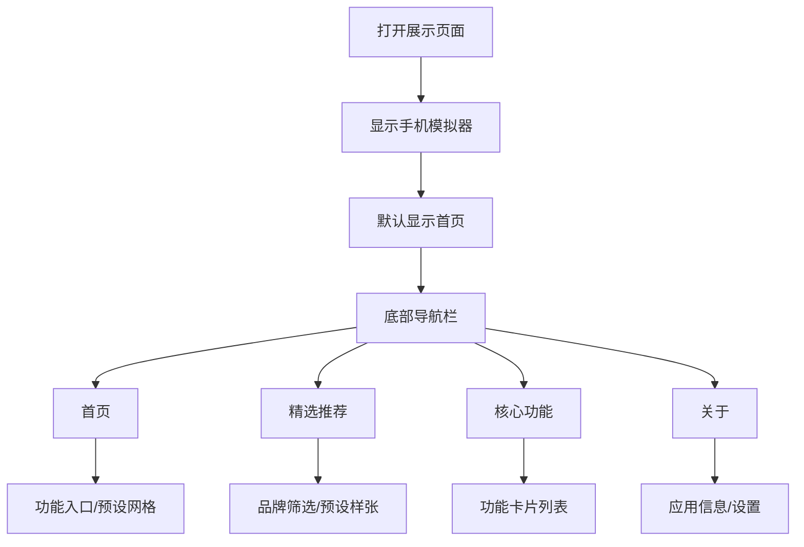

# OMaster Android App UI 展示页面 - 产品需求文档

## 1. 产品概述

一个 Web 展示页面，用于展示 OMaster Android 应用的 UI 功能界面。通过模拟手机界面，让用户可以在浏览器中预览 App 的各项功能页面，包括首页、精选推荐、核心功能和关于页面。

- 目标用户：想要了解 OMaster App 功能的潜在用户
- 核心价值：无需安装 App 即可预览完整界面

## 2. 核心功能

### 2.1 功能模块

1. **手机模拟器框架**：
   - 逼真的手机外壳（iPhone/Android 风格）
   - 屏幕区域展示 App 界面
   - 底部导航栏交互

2. **App 页面展示**：
   - **首页**：展示预设卡片网格、Tab 切换、功能入口卡片
   - **精选推荐**：展示精选预设样张、品牌筛选、应用参数功能
   - **核心功能**：展示 6 大功能入口（AI场景识别、AI微调、水印编辑、智能优化、预设管理、参数精细调节）
   - **关于页面**：应用信息、版本号、设置入口

3. **交互功能**：
   - 底部导航栏切换页面
   - 页面内滚动效果
   - 卡片点击交互反馈
   - 开关切换动画

### 2.2 页面详情

| 页面名称 | 模块名称 | 功能描述 |
|---------|---------|---------|
| 首页 | 标题栏 | 应用名称展示 |
| 首页 | 功能入口 | 6个功能快捷入口卡片（AI场景、AI微调、水印、优化、预设、参数）|
| 首页 | Tab栏 | 全部/收藏/我的 三个标签切换 |
| 首页 | 预设网格 | 瀑布流布局展示预设卡片 |
| 精选推荐 | 标题栏 | 搜索和筛选按钮 |
| 精选推荐 | 品牌筛选 | OPPO/realme/vivo/荣耀/小米 品牌筛选芯片 |
| 精选推荐 | 场景筛选 | 人像/风景/夜景/美食/街拍/建筑 场景筛选 |
| 精选推荐 | 预设网格 | 双列网格展示精选预设样张 |
| 核心功能 | 区域标题 | AI智能功能/专业工具/品牌特色 三大区域 |
| 核心功能 | 功能卡片 | 8个功能卡片，带开关和渐变背景 |
| 关于页面 | 应用信息 | Logo、版本号、开发者信息 |
| 关于页面 | 设置列表 | 主题切换、深色模式、更新检查等 |

## 3. 核心流程

用户打开展示页面后，可以看到一个手机模拟器，默认显示首页。用户可以通过底部导航栏切换不同的 App 页面，每个页面都展示了对应的功能模块和交互元素。

## 4. 用户界面设计

### 4.1 设计风格

- **整体风格**：深色主题，专业影像工具风格
- **主色调**：纯黑背景 (#0A0A0A)，哈苏橙色强调 (#FF6B35)
- **卡片样式**：圆角 16px，渐变背景，微妙阴影
- **字体**：系统无衬线字体，层次分明
- **布局**：手机模拟器居中，屏幕内采用现代卡片式布局
- **动画**：平滑过渡、微交互动画、卡片悬停效果

### 4.2 页面设计概述

| 页面名称 | 模块名称 | UI 元素 |
|---------|---------|---------|
| 首页 | 标题栏 | 白色文字，左对齐 |
| 首页 | 功能入口 | 6个等宽卡片，彩色图标，圆角 |
| 首页 | Tab栏 | 底部指示器，选中高亮 |
| 首页 | 预设网格 | 瀑布流，交错高度，圆角图片 |
| 精选推荐 | 筛选栏 | 横向滚动，选中状态 |
| 精选推荐 | 预设卡片 | 图片+信息+应用按钮 |
| 核心功能 | 区域标题 | 图标+标题+描述 |
| 核心功能 | 功能卡片 | 渐变背景，开关，点击反馈 |
| 关于页面 | 信息卡片 | 居中布局，Logo，版本号 |

### 4.3 响应式设计

- 桌面端：手机模拟器居中显示，适当比例缩放
- 移动端：全屏展示，保持手机比例
- 触摸优化：按钮和卡片有适当的点击区域

### 4.4 动画效果

- 页面切换：淡入淡出 + 滑动效果
- 卡片悬停：轻微放大 + 阴影增强
- 开关切换：弹性动画
- 导航切换：图标弹跳反馈
- 滚动效果：视差滚动，渐变遮罩
