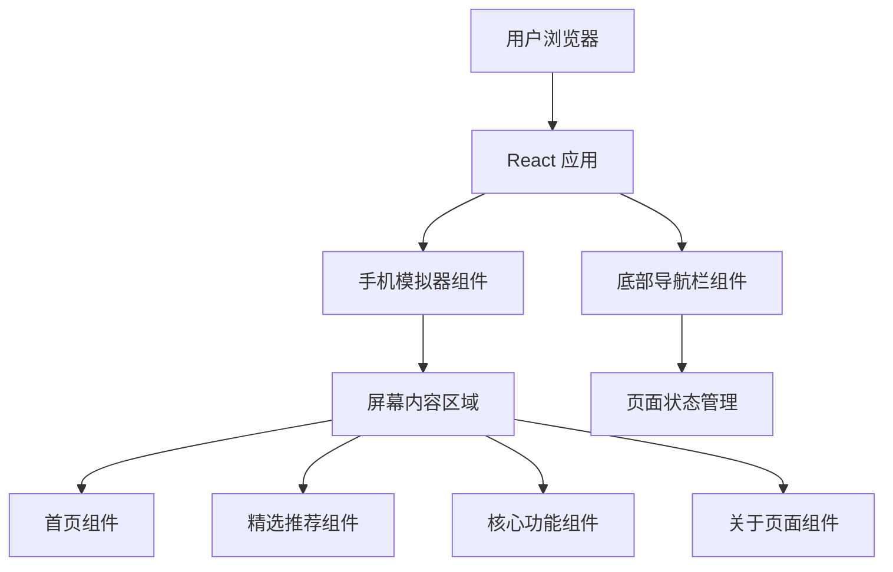

# OMaster Android App UI 展示页面 - 技术架构文档

## 1. 架构设计



## 2. 技术描述

- **前端框架**：React 18 + TypeScript
- **构建工具**：Vite
- **样式方案**：Tailwind CSS
- **状态管理**：Zustand
- **图标库**：Lucide React
- **动画**：CSS Transitions + Framer Motion（可选）

## 3. 路由定义

| 路由 | 用途 |
|-----|------|
| / | 展示页面（单页面应用） |

## 4. 组件结构

### 4.1 页面组件

| 组件名称 | 文件路径 | 描述 |
|---------|---------|------|
| PhoneMockup | src/components/PhoneMockup.tsx | 手机外壳模拟器 |
| ScreenContent | src/components/ScreenContent.tsx | 屏幕内容容器 |
| BottomNav | src/components/BottomNav.tsx | 底部导航栏 |
| HomeScreen | src/pages/HomeScreen.tsx | 首页 |
| FeaturedScreen | src/pages/FeaturedScreen.tsx | 精选推荐 |
| FeaturesScreen | src/pages/FeaturesScreen.tsx | 核心功能 |
| AboutScreen | src/pages/AboutScreen.tsx | 关于页面 |

### 4.2 共享组件

| 组件名称 | 文件路径 | 描述 |
|---------|---------|------|
| FeatureCard | src/components/FeatureCard.tsx | 功能入口卡片 |
| PresetCard | src/components/PresetCard.tsx | 预设卡片 |
| FilterChip | src/components/FilterChip.tsx | 筛选芯片 |
| ToggleSwitch | src/components/ToggleSwitch.tsx | 开关组件 |
| SectionHeader | src/components/SectionHeader.tsx | 区域标题 |

## 5. 状态管理

使用 Zustand 管理应用状态：

```typescript
interface AppState {
  currentPage: 'home' | 'featured' | 'features' | 'about';
  setCurrentPage: (page: string) => void;
  selectedTab: number;
  setSelectedTab: (tab: number) => void;
  selectedBrand: string | null;
  setSelectedBrand: (brand: string | null) => void;
  selectedScene: string | null;
  setSelectedScene: (scene: string | null) => void;
}
```

## 6. 数据结构

### 6.1 预设数据

```typescript
interface Preset {
  id: string;
  name: string;
  coverPath: string;
  author: string;
  brand: string;
  tags: string[];
  isNew: boolean;
  isHncs: boolean;
  saturation: number;
  contrast: number;
  warmth: number;
  sharpness: number;
}
```

### 6.2 功能数据

```typescript
interface Feature {
  id: string;
  title: string;
  subtitle: string;
  icon: string;
  color: string;
  gradientColors: string[];
  enabled: boolean;
}
```

## 7. 样式规范

### 7.1 颜色变量

```css
:root {
  --bg-primary: #0A0A0A;
  --bg-secondary: #1A1A1A;
  --bg-card: #252525;
  --accent-primary: #FF6B35;
  --accent-secondary: #FF8C42;
  --text-primary: #FFFFFF;
  --text-secondary: rgba(255, 255, 255, 0.6);
  --text-muted: rgba(255, 255, 255, 0.4);
}
```

### 7.2 尺寸规范

- 手机宽度：375px（iPhone 标准）
- 手机高度：812px（iPhone X 比例）
- 圆角：40px（手机外壳）
- 屏幕圆角：35px
- 卡片圆角：16px
- 按钮圆角：12px

### 7.3 间距规范

- 页面内边距：16px
- 卡片间距：12px
- 元素间距：8px / 12px / 16px
